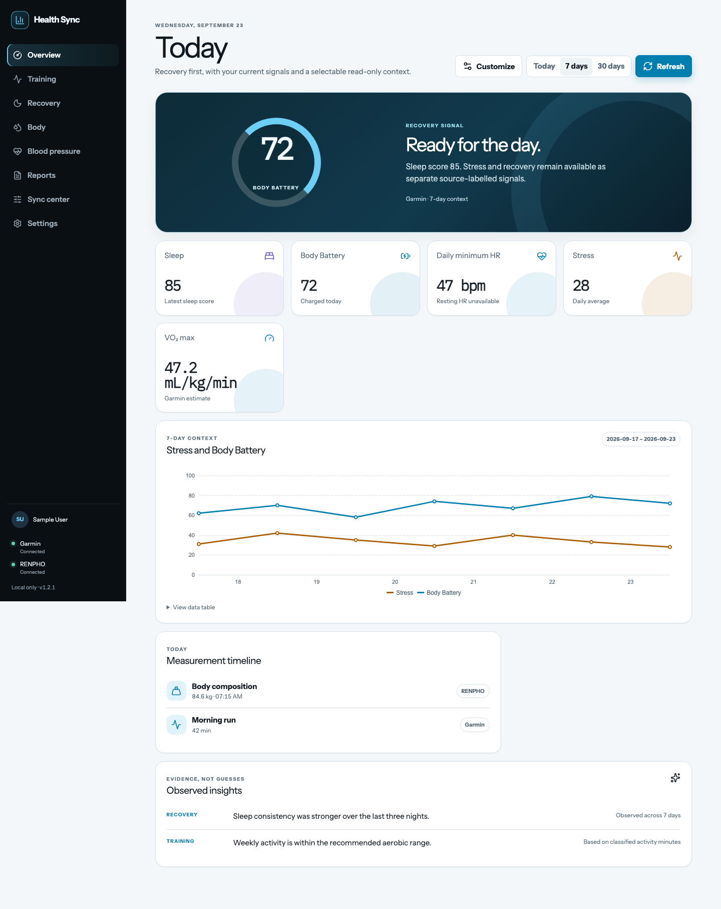

# Garmin Health Sync

[](https://github.com/aarogozin/garmin-health-sync/actions/workflows/ci.yml)
[](https://github.com/aarogozin/garmin-health-sync/releases/latest)
[](LICENSE)

A local health dashboard for Garmin Connect, RENPHO body measurements, and manually entered blood pressure. Review trends, sync weight to Garmin, and export private Markdown notes for discussions with a clinician or an AI assistant.



## Interface

The desktop dashboard uses the **Atlas** layout: a recovery-first overview, a
seven-day context chart, quiet supporting metrics, and a persistent operation
surface for syncs that need attention. Training, recovery, body and blood
pressure each keep their own unit-aware charts, source labels and accessible data
tables. On smaller screens the sidebar becomes bottom navigation with a concise
**More** sheet; no health data is placed in browser storage.

The light theme is the default, with system and dark-theme options in **Settings**.
The visual system is Garmin-inspired rather than Garmin-branded: it uses neutral
surfaces and a restrained accessible blue for actions, while retaining the
project's independent Health Sync identity.

Garmin Health Sync is an independent project. Garmin and RENPHO integrations use unofficial APIs and may stop working when those services change. Reports describe observations; they are not diagnoses or medical records.

## Start on macOS

Install and open [Docker Desktop](https://www.docker.com/products/docker-desktop/), then run:

```bash
git clone https://github.com/aarogozin/garmin-health-sync.git
cd garmin-health-sync
./health-sync start
```

The launcher builds the application, initializes private storage, waits for the local server, and opens [the dashboard](http://127.0.0.1:8080). The first build downloads dependencies and takes longer than later starts. Python, Node.js, and Go are not required on the host for normal use.

1. Connect Garmin in onboarding or **Settings**. Complete MFA in the Activity Center when requested.
2. Connect RENPHO if you want scale data and body synchronization.
3. Open **Sync Center**, preview the latest measurement or history, and confirm the upload.
4. Optionally enable the Markdown archive in **Settings**. Initial setup collects the preceding 90 days.

The application runs in the background after the launcher exits. Use `./health-sync stop` to stop it. Closing a browser tab does not stop the container.

## Capabilities and boundaries

| Area | Available behavior |
| --- | --- |
| Overview and recovery | Garmin sleep, heart rate/HRV, stress, Body Battery, VO₂ max when the device provides it, and other returned metrics |
| Training | Garmin activity summaries, links to Garmin Connect, and optional routes in reports |
| Body | RENPHO weight/composition and circumference history when supplied by the cloud |
| Blood pressure | Manual entry, validation, preview, duplicate detection and verification in Garmin |
| Sync | On startup, safely reconcile the latest RENPHO measurement with Garmin; preview history manually, one selected measurement per day |
| Reports | Seven-day web, PDF and Markdown reports, with 30-day lifestyle context when available |
| Archive | Optional daily and weekly Markdown notes, a profile summary, and an index |
| AI context | Strict JSON and matching Markdown for Current, 7-day and 30-day analysis |
| Scheduling | Daily macOS LaunchAgent invoking the same Docker runtime and storage |

Downloaded weekly reports and AI context exports include their local generation
date and time in the filename, for example
`weekly-health-report-2026-09-20_09-15-30.pdf` and
`health-context-30d-2026-09-20_09-15-30.json`. Repeated exports therefore do not
silently overwrite one another.

Garmin activity uploads to RENPHO were removed. There is no supported reverse activity sync. Missing device-specific metrics are reported as unavailable, not inferred.

The runtime is single-user and published only on `127.0.0.1:8080`. Internet hosting, LAN access, and multi-user authentication are outside its supported deployment model.

## Everyday commands

Run these commands from the checkout:

```bash
./health-sync start                  # Build/start, wait for readiness, open the browser
./health-sync status                 # Show container state without changing credentials
./health-sync logs --tail=50          # Inspect container output
./health-sync stop                   # Stop containers; keep data and Markdown notes

git pull --ff-only
./health-sync update                 # Rebuild the checked-out code and restart

./health-sync sync daily             # Unattended latest-weight sync, then archive refresh
./health-sync archive setup          # Opt in and import 90 days
./health-sync archive backfill --days 30
./health-sync archive refresh        # Refresh today
./health-sync archive status
./health-sync context generate --period 30d
```

GUI uploads always require preview and confirmation. **`sync daily` is deliberately unattended and can write weight to Garmin without a prompt.** It also refreshes an enabled archive, independently of the weight-sync outcome.

When the GUI starts with both sources connected, it also checks the latest RENPHO
measurement. An exact Garmin match is left untouched, a different same-day record
is reported as a conflict, and an uncertain upload is never retried automatically.

Exit code `0` means the command completed, `2` indicates a handled failure or conflict, and `3` indicates an uncertain upload. Partial report/archive collections can still produce useful output; read their availability status. Never automatically repeat an uncertain upload.

## Daily scheduling

Use **Sync Center → Daily body sync**, or:

```bash
./health-sync schedule install 7 30   # Daily at 07:30 in the Mac's local timezone
./health-sync schedule status
./health-sync schedule run           # Trigger the installed job; performs an unattended sync
./health-sync schedule remove
```

The macOS helper manages only `com.local.garmin-health-sync.docker`. Its plist invokes this checkout's absolute `health-sync sync daily` path and preserves configured runtime/archive locations. Keep the checkout in place; reinstall the schedule after moving it. The user must be logged in and Docker Desktop must be usable. This is a user LaunchAgent, not a system daemon.

The helper binds to loopback and requires a random private capability token. The container reaches it through Docker Desktop's `host.docker.internal` hostname. It exposes fixed scheduling actions and an archive-folder opener; no Docker socket is mounted into the application.

If scheduling becomes unavailable after a restart, run `./health-sync start`. Status, logs, archive commands, and schedule inspection preserve the running helper's capability. The checksum validates local helper integrity; it is not a publisher signature or Apple notarization.

## Your files and credentials

| Location | Contents |
| --- | --- |
| `~/Documents/Garmin Health Sync` | Opt-in Markdown health workspace, mounted at `/archive` |
| `~/Library/Application Support/Garmin Health Sync Docker` | Encryption key, private Compose configuration, helper and readiness metadata |
| Compose volume `garmin-sync-data` | Encrypted credentials and duplicate-protection state, mounted at `/data` |

Compose prefixes the volume name with its project name. For a checkout named `garmin-health-sync`, the Docker volume is normally `garmin-health-sync_garmin-sync-data`. Renaming the checkout or changing the Compose project name can select a different volume. Check `docker volume ls` before migrating data.

The launcher creates private directories with mode `0700`; keys, runtime configuration and Markdown documents use `0600`. Credentials use Fernet encryption with a separately mounted key. Garmin passwords are used for login; the saved Garmin credential is an OAuth session. RENPHO credentials are retained because its cloud client needs to authenticate again.

To choose another visible workspace:

```bash
GARMIN_SYNC_ARCHIVE_HOST_DIR="/absolute/path/My health notes" ./health-sync start
```

That choice is remembered in the private runtime directory. `GARMIN_SYNC_RUNTIME_DIR` can also select a dedicated runtime directory; supply it consistently when invoking the launcher. Changing paths does not copy or migrate existing notes or credentials.

Back up the Docker data volume **and its matching encryption key**, separately from the Markdown archive. Losing the key makes existing encrypted credentials unreadable. `stop` and `update` retain both storage areas. Removing a Docker volume is a separate, destructive operation.

### Migrating from an earlier installation

- **Native Python/Keychain:** Docker has a separate credential store. Sign in again through the Docker UI. If a native schedule exists, remove it with `uv run garmin-sync schedule uninstall` before installing the Docker schedule.
- **Older Compose with `docker/secret.key`:** retain the existing volume and copy its matching key to the private runtime's `secret.key` before the first launcher start. Do not generate a replacement key for that volume.
- **Different archive folder:** stop the app, copy your Markdown workspace to the new private directory, then restart with the chosen archive path.

## Markdown workspace for AI discussions

Archive setup is optional. The launcher creates its mount directory, but health notes are generated only after archive setup or an explicit report download.

```text
Garmin Health Sync/
  .gitignore
  README.md
  users/default/
    PROFILE.md
    INDEX.md
    daily/YYYY/MM/YYYY-MM-DD.md
    weekly/YYYY/YYYY-Www.md
    context/
      CURRENT.json
      CURRENT.md
      LAST_7_DAYS.json
      LAST_7_DAYS.md
      LAST_30_DAYS.json
      LAST_30_DAYS.md
```

Notes contain versioned YAML front matter, period/timezone, source availability, and normalized tables for available body, training, pressure, recovery, activity, nutrition totals, and lifestyle data. Sources stay labeled. `PROFILE.md` provides context from the most recently archived snapshot; it is not a lifetime medical history.

Daily and weekly notes omit activity titles. AI context files intentionally retain titles so an assistant can discuss specific workouts, but still exclude GPS/location data, account identifiers, avatar URLs, raw API responses, credentials and PDFs. Missing values stay missing. File names are deterministic and complete exports replace them atomically. A partial AI export remains downloadable in memory but never replaces the last complete archived context.

The files are **plain-text health data**. A defensive `.gitignore` prevents ordinary Git additions, but it does not encrypt the folder or disable backups/cloud sync. On macOS, Documents may already be synchronized with iCloud. Choose another directory if needed. Giving an AI tool this folder grants it access to the exported health information.

Use **Reports → AI Health Context** to generate Current, 7-day or 30-day JSON/Markdown pairs. JSON follows `garmin-health-sync/ai-context@3`; Markdown is rendered from the same model. The top-level `summary` provides latest metrics, 7/30-day trends, data-quality flags, exercise progression and an intentionally conservative energy-balance status. Detailed timelines live under `raw_data`. Current includes today's events plus the latest dated body baseline when no measurement exists today. When Garmin records strength sets, the export preserves normalized exercise keys, set numbers, repetitions, weights, warm-up markers and provider-supplied RIR/RPE, then derives working-weight, volume and Epley estimated-1RM trends. Missing strength fields remain `null`; they are never reconstructed from heart rate or duration. Recognized exercises receive conservative, explicitly `inferred` primary/secondary muscle labels; unknown exercises remain unmapped. Logged intake remains separate from goals, Garmin activity calories are explicitly labelled, heart-rate zones are named, custom activity titles are excluded to prevent location leakage, and derived insights remain separate from provider measurements.

**Reports → Download Markdown** exports the current seven-day report without enabling the archive. PDF, web and partial AI snapshots otherwise remain in memory until downloaded or the process stops.

## How synchronization works

- Timestamps use `Europe/Berlin` when the source supplies no timezone.
- Historical RENPHO sync selects the latest measurement per calendar day.
- An exact remote duplicate is skipped. A conflicting Garmin date is not overwritten.
- Supported RENPHO composition percentages are converted to kilograms for Garmin.
- Metabolic age is displayed in reports but omitted from Garmin FIT uploads because that import path is unreliable.
- Blood-pressure duplicates match UTC time, systolic, diastolic and pulse.
- After a write, the app reads Garmin to verify the record. Delayed weight verification performs read-only checks; it never repeats the upload.
- A process lock coordinates upload operations using the same state directory.

Device coverage and consumer-sensor accuracy vary. Short-term BIA changes can reflect hydration or measurement conditions. Lifestyle comparisons are observed associations, not evidence of causation.

## Privacy and security

The Flask API uses CSRF tokens, Host/Origin validation, request-size limits, HTML escaping and `Cache-Control: no-store`. Assets are served locally, without analytics or external fonts. Only interface preferences are saved in browser storage.

Routes stay in process memory. OpenStreetMap tiles require explicit opt-in; enabling them discloses the requested tile region and your IP address to the tile provider. Exported files and private archives have their own persistence lifecycle.

Docker runs as an unprivileged user with a read-only root filesystem, dropped capabilities and `no-new-privileges`. The named data volume and archive bind mount remain writable. Native development uses macOS Keychain instead of the encrypted Docker store.

Report vulnerabilities through [GitHub's private advisory form](https://github.com/aarogozin/garmin-health-sync/security/advisories/new). Do not attach credentials or real health records to issues. See [SECURITY.md](SECURITY.md).

## Troubleshooting

| Symptom | What to check |
| --- | --- |
| Docker is unavailable | Start Docker Desktop and wait for its engine, then rerun `./health-sync start`. |
| Port 8080 is in use | Stop the other listener or a previous instance before starting this checkout. |
| Garmin or RENPHO needs login | Reconnect through Settings in the same runtime/volume. |
| MFA expires | Start a new Garmin login. The expired job must finish with an error, releasing the worker. |
| Schedule controls are unavailable | Restart with `./health-sync start`; check Docker Desktop's access to the loopback host helper. |
| Encrypted store cannot be read | Restore the matching key and volume. Do not overwrite the key to “fix” decryption. |
| Report is partial | Read Data availability; some endpoints depend on the Garmin device or account. |
| Upload is uncertain | Inspect Garmin Connect before retrying. |
| Archive cannot be written | Check the host folder and Docker Desktop file-sharing permissions. |
| A dashboard looks stale after code changes | Run `./health-sync update`, then reload the browser. |

## Development and architecture

Normal use is Docker-first. Native development requires Python 3.12+, [uv](https://docs.astral.sh/uv/), and Node.js 24:

```bash
uv sync --frozen --group dev
npm --prefix frontend ci --ignore-scripts
npm --prefix frontend run build
uv run garmin-sync gui
```

For live frontend changes, run the backend with `GARMIN_SYNC_PORT=8080 uv run garmin-sync gui`, then `npm --prefix frontend run dev`. Vite proxies local API/asset requests to Flask. Native credentials live in Keychain and are separate from Docker.

| Component | Responsibility |
| --- | --- |
| `frontend/src` | React/TypeScript views, chart interactions and jobs |
| `web_api.py`, `api_models.py` | Versioned JSON endpoints and request validation |
| `service.py` | Sync, collection and archive workflows |
| `garmin.py`, `renpho.py` | Provider adapters and normalized reads/writes |
| `weekly_report.py`, `weekly_pdf.py` | Shared report model, chart specifications and PDF rendering |
| `ai_context.py` | Strict AI export schema, trend calculations and synchronized JSON/Markdown rendering |
| `archive.py` | Privacy-filtered Markdown rendering and atomic persistence |
| `secrets.py`, `state.py`, `operation_lock.py` | Credential storage, duplicate ledger and write coordination |
| `health-sync`, `host_helper`, `scheduler.py` | Docker launcher and macOS scheduling bridge |

The older HTML routes and renderer remain for compatibility while frontend parity is completed. They are active code, not a second supported deployment. New product work belongs in the React interface and `/api/v1`. The API is internal and may change.

Useful checks:

```bash
uv run ruff check .
uv run mypy
uv run pytest
uv lock --check
npm --prefix frontend run typecheck
npm --prefix frontend run lint
npm --prefix frontend test
npm --prefix frontend run build
(cd host_helper && go test ./...)
```

Go is needed only for host-helper development tests; the launcher builds the macOS binary inside Docker. Python and frontend versions are locked; build stages are pinned in the Dockerfile. Production contains Python and compiled web assets, without Node or Go build tools.

See [CONTRIBUTING.md](CONTRIBUTING.md) for API schema generation, E2E checks and contribution rules, [docs/CODE_REVIEW.md](docs/CODE_REVIEW.md) for an audit scope and tracked follow-up work, and [CHANGELOG.md](CHANGELOG.md) for historical changes.

## License and attribution

[MIT](LICENSE). Garmin and RENPHO names are used to identify supported services; this project is not affiliated with either company. Third-party licenses and asset attribution are listed in [THIRD_PARTY_NOTICES.md](THIRD_PARTY_NOTICES.md).
